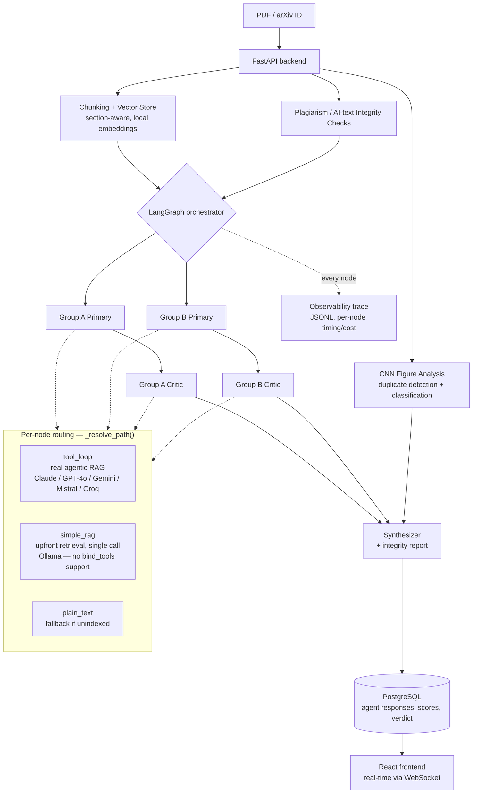

# PaperLens

> Multi-agent AI system for scientific paper peer review — two independent reviewer groups (running agentic RAG, not full-text prompt stuffing) debate in parallel, cross-checked by plagiarism/AI-text/figure-integrity signals, then a synthesizer produces a consolidated verdict.

**Validated, not just built:** see [`evaluation/`](backend/evaluation/) for the agreement-rate methodology against human reviewers, and [`PLACEMENT_UPGRADES.md`](PLACEMENT_UPGRADES.md) for the full engineering changelog (observability, testing, cost tracking, security hardening).

---

## Architecture



Every node's retrieval-loop path is decided automatically per assigned
model — see `_resolve_path()` in `backend/app/agents/orchestrator.py`.
This exists specifically because local Ollama models don't support
LangChain's `bind_tools()`, so they get a non-looping retrieval fallback
instead of crashing.

---

## Results

Run `backend/evaluation/run_eval.py` against a labeled set of papers with
known human outcomes to generate real agreement metrics (exact/adjacent
agreement, confusion matrix, per-category precision/recall/F1, latency).
See [`backend/evaluation/`](backend/evaluation/) for the methodology and
input format. Populate `evaluation/eval_report.md` with your own run's
numbers before citing this in a resume/interview — the framework is
built, the numbers are yours to generate on your own paper set.

---

## Local Setup (SQLite — no Docker needed)

### 1. Clone and configure

```bash
git clone <repo>
cd PaperLens
```

### 2. Backend

```bash
cd backend
python -m venv .venv
# Windows:
.venv\Scripts\activate
# macOS/Linux:
source .venv/bin/activate

pip install -r requirements.txt

cp .env.example .env
# Edit .env — add your API keys
```

Start the server:

```bash
uvicorn app.main:app --reload --port 8000
```

The API is live at http://localhost:8000  
Interactive docs: http://localhost:8000/docs

### 3. Frontend

```bash
cd frontend
npm install
npm run dev
```

Open http://localhost:5173

---

## Docker Compose (PostgreSQL + backend + frontend)

```bash
cp backend/.env.example backend/.env
# Edit backend/.env — add your real API keys

docker compose up --build
```

- Frontend: http://localhost:5173  
- Backend API: http://localhost:8000  
- API docs: http://localhost:8000/docs

---

## Swapping Agent Models

Edit `backend/.env` (or set environment variables):

```env
AGENT_MODEL_GROUP_A_PRIMARY=claude-3-5-sonnet-20241022
AGENT_MODEL_GROUP_A_CRITIC=gemini-1.5-pro-latest
AGENT_MODEL_GROUP_B_PRIMARY=gpt-4o
AGENT_MODEL_GROUP_B_CRITIC=mistral-large-latest
AGENT_MODEL_SYNTHESIZER=claude-3-5-sonnet-20241022
```

Supported model name patterns:
| Pattern      | Provider           |
|--------------|--------------------|
| `claude-*`   | Anthropic          |
| `gpt-*`, `o1-*`, `o3-*` | OpenAI  |
| `gemini-*`   | Google             |
| `mistral-*`, `mixtral-*` | Mistral |
| `grok-*`     | xAI                |
| `glm-*`      | Z.ai               |
| `llama-3.3-70b-versatile`, `llama-3.1-8b-instant` | Groq (free tier) |
| `ollama:*`, `llama3*`, `qwen*`, `mistral-local` | Local Ollama — no API cost, runs on your machine |

**Using local Ollama models:** these get a different code path
automatically (`simple_rag` instead of `tool_loop` — see the Architecture
diagram above) since the local client doesn't support LangChain's
tool-calling interface. Retrieval still happens, just upfront rather than
adaptively. Free-tier and local models are useful if you [can't pay for
paid API keys](https://ai.google.dev/) — Google AI Studio (Gemini) and
Groq both offer genuinely free tiers with no card required.

You can also override per-request via the API:

```json
POST /api/review
{
  "paper_id": "...",
  "model_config": {
    "group_a_primary": "claude-opus-4-0",
    "synthesizer": "gpt-4o"
  }
}
```

---

## API Reference

| Method | Path | Description |
|--------|------|-------------|
| `POST` | `/api/papers/upload` | Upload PDF (multipart) — rate limited 10/min |
| `POST` | `/api/papers/arxiv` | Fetch by arXiv ID |
| `POST` | `/api/review` | Start a review job — rate limited 5/min |
| `GET`  | `/api/review/{id}` | Poll status + results |
| `GET`  | `/api/review/{id}/trace` | Full structured event trace for a job (per-node timing, path taken, model, cost) |
| `WS`   | `/ws/review/{id}` | Real-time progress stream |
| `GET`  | `/api/history` | List past reviews |
| `GET`  | `/api/stats/cost-dashboard` | Aggregated cost/latency stats across recent jobs |
| `GET`  | `/health` | Liveness + DB connectivity check |

---

## Testing

```bash
cd backend
pip install pytest
pytest tests/ -v
```

26 tests across chunking logic, the AI-text heuristic scorer, CNN
duplicate-figure detection, and cost estimation — including a specific
regression guard (`test_orchestrator_routing.py`) locking in that Ollama
models can never route to the tool-calling path that used to crash them.

---

## Production Notes

**Done:**
- Rate limiting (slowapi) on the expensive endpoints — see `THREAT_MODEL.md`
- PDF magic-byte validation on upload, not just extension/size
- Security headers (X-Frame-Options, HSTS, etc.)
- CORS locked to an explicit origin allowlist, deployment-URL-aware via `FRONTEND_URL`
- PostgreSQL support via `DATABASE_URL` (SQLite for local dev)
- Auth layer (JWT via `passlib`/`pyjwt`)
- Structured observability (`GET /api/review/{id}/trace`) and cost tracking (`GET /api/stats/cost-dashboard`)

**Still open:**
- Replace `FastAPI BackgroundTasks` with **Celery + Redis** for true async job queuing at scale
- Replace local PDF storage with an **S3-compatible bucket**
- Prompt-injection defense for paper content fed into reviewer prompts — see `THREAT_MODEL.md`'s known-gaps section for why this is genuinely hard, not just unaddressed

---

## Further Reading

- [`PLACEMENT_UPGRADES.md`](PLACEMENT_UPGRADES.md) — full changelog of the agentic RAG, evaluation, observability, testing, and cost-tracking additions
- [`THREAT_MODEL.md`](THREAT_MODEL.md) — what's mitigated, what's a known gap, and why
- [`DEPLOYMENT.md`](DEPLOYMENT.md) — full setup + cloud deployment guide, including an honest RAM sizing discussion for the torch/chromadb footprint
- [`backend/evaluation/`](backend/evaluation/) — the evaluation framework and methodology

---

## Limitations / Honest Assessment

PaperLens is a **pre-review tool**, not a replacement for human peer review. It:
- May miss domain-specific nuances that only human experts would catch
- Is only as good as the LLMs' training data and context window
- Should be used to assist, augment, and speed up — not replace — the review process
- All scores and recommendations should be treated as *starting points* for human reviewers
